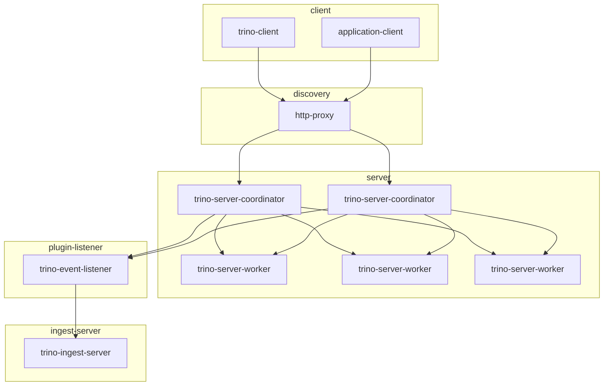

# Trino安装与部署

> Trino 402

<style>
  h1 {
    counter-reset: h2
  }
  h2 {
    counter-reset: h3
  }
  h2:before {
    counter-increment: h2;
    content: counter(h2) ". "
  }
  h3:before {
    counter-increment: h3;
    content: counter(h2) "." counter(h3) ". "
  }
</style>

[TOC]

<br>

## Trino整体架构



<br>

## 安装包准备

| 文件 | 类型 | 描述 |
| ----------------------- | ------------- | - |
| trino-server-402.tar.gz | Trino Server  | |
| jdk-17.0.5_linux-x64_bin.tar.gz | Java | Trino-Server-402 requires Java 17+ |

<br>

## Trino-Server环境准备

### 修改启动脚本

+ bin/launcher modify example
  
  + ```shell
      export JAVA_HOME=/usr/local/jdk-17.0.5    # add
      export PATH=$JAVA_HOME/bin:$PATH          # add
      exec "$(dirname "$0")/launcher.py" "$@"
      ```

<br>

### 修改配置

#### 服务进程应用配置

+ etc/config.properties initialize example
  
  + ```ini
      # coordinator
      coordinator=true
      node-scheduler.include-coordinator=false
      http-server.http.port=9000
      discovery.uri=http://example.xyz/discovery

      event-listener.config-files=etc/http-event-listener.properties
      ```

  + ```ini
      # worker
      coordinator=false
      http-server.http.port=9000
      discovery.uri=http://example.xyz/discovery
      ```

| 配置项 | 描述 |
| ----------- | ---------------------------------------------------- |
| coordinator | ture: 当前节点作为Coordinator; false: 当前节点作为Worker |
| node-scheduler.include-coordinator | 是否允许在Coordinator上执行计算任务 |
| http-server.http.port | 指定Trino HTTP Server的端口号 |
| discovery.uri | Discovery服务的URI |
| event-listener.config-files | 指定事件监听器配置文件路径 |

<br>

### Trino服务进程的Java运行环境

+ etc/jvm.config

<br>

### 日志配置

+ etc/log.properties initialize example

  + ```ini
      io.trino=INFO
      ```

| 配置项 | 描述 |
| -------- | --------------------- |
| io.trino | 设置logger的最小日志级别 |

<br>

### 节点属性配置

+ etc/node.properties initialize example

  + ```ini
      node.environment=production
      node.id=ffffffff-ffff-ffff-ffff-ffffffffffff
      node.data-dir=/var/trino/data
      ```

| 配置项 | 描述 |
| ---------------- | --------------- |
| node.environment | Trino运行环境名称 |
| node.id | Trino集群中的每个node的唯一标示，属于同一个Trino集群的各个Trino node的标示必须是不同的 |
| node.data-dir | 在每个Trino node所在服务器的操作系统中的路径 |

<br>

### 事件监听器配置

> <https://trino.io/docs/current/admin/event-listeners-http.html>

+ etc/http-event-listener.properties initialize example

  + ```ini
      event-listener.name=http
      http-event-listener.log-created=true
      http-event-listener.log-completed=true
      http-event-listener.log-split=true
      http-event-listener.connect-ingest-uri=http://example.xyz/ingest
      ```

| 配置项 | 描述 |
| ------------------- | --------------------- |
| event-listener.name | 指定plugin中的事件监听器 |
| http-event-listener.log-created | 启用创建查询执行事件的日志记录 |
| http-event-listener.log-completed | 启用完成查询执行事件的日志记录 |
| http-event-listener.log-split | 启用分段查询执行事件的日志记录 |
| http-event-listener.connect-ingest-uri | 事件日志记录投递的连接地址 |

<br>

## Trino-Ingest-Server

### 服务接收参数

+ json格式

| 名称 | 类型 | 描述 |
| ---------- | ------ | ------- |
| createTime | String | 查询请求创建时间 |
| context | Object | 查询请求上下文 |
| metadata | Object | 查询请求元数据 |

+ context参数

| 名称 | 类型 | 描述 |
| ---- | ------ | ---------- |
| user | String | 查询请求用户名 |
| principal | String | 查询请求用户主体 |
| groups | Array | 查询请求用户组 |
| remoteClientAddress | String | 查询请求远程客户端地址 |
| userAgent | String | 查询请求用户代理 |
| clientTags | Array | 查询请求客户端标签组 |
| clientCapabilities | Array | 查询请求客户端功能列表 |
| source | String | 查询请求来源 |
| resourceGroupId | Array | 查询请求资源组id |
| sessionProperties | Object | 查询请求会话属性 |
| resourceEstimates | Object | 查询请求资源估算 |
| serverAddress | String | 查询请求服务器地址 |
| serverVersion | String | 查询请求服务器版本 |
| environment | String | 查询请求所在环境 |
| queryType | String | 查询请求类型 |
| retryPolicy | String | 通信重试策略 |

+ metadata参数

| 名称 | 类型 | 描述 |
| ------- | ------ | ---------- |
| queryId | String | 查询请求id |
| transactionId | String | 查询请求事务id |
| query | String | 查询请求sql |
| queryState | String | 查询请求状态 |
| tables | Array | 查询请求关联表 |
| routines | Array | 查询请求例程 |
| uri | String | 查询请求统一资源标识符 |

<br>

### 数据库设计

+ 查询请求记录表t_query_log

| 名称 | 类型 | 描述 |
| ------- | ------ | --------- |
| queryId | String | 查询请求id |
| transactionId | String | 查询请求事务id |
| query | String | 查询请求sql |
| queryState | String | 查询请求状态 |
| uri | String | 查询请求统一资源标识符 |
| user | String | 查询请求用户名 |
| source | String | 查询请求来源 |
| serverAddress | String | 查询请求服务器地址 |
| serverVersion | String | 查询请求服务器版本 |
| environment | String | 查询请求所在环境 |
| queryType | String | 查询请求类型 |
| createTime | String | 查询请求创建时间 |
